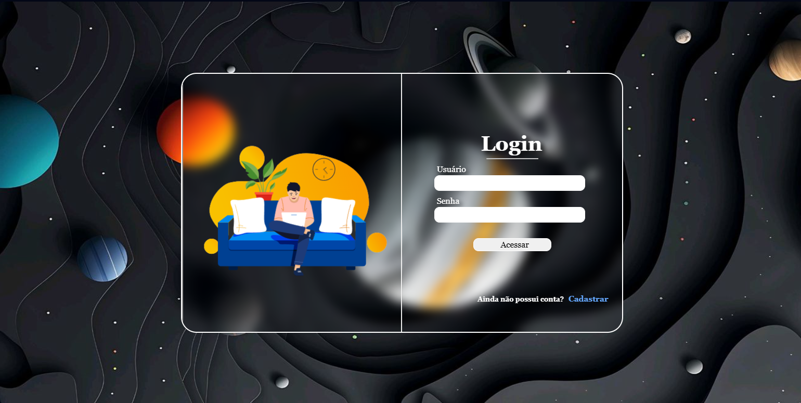

# Primeiro-projeto

*Esse projeto foi desenvolvimento ao longo da matéria de Banco de dados 2, no curso de sistemas para internet(IFPE).
A proposta era desenvolver um sistemas funcional para gerenciar alunos de um sistemas escolar, dando foco a conexão com o banco de dados mysql;*

1. O que ela faz?
   - O sistema trabalha fazendo o CRUD de entidades como : aluno, professor, disciplina, turma, notas;
     
2. Qual o objetivo da aplicação?
   - Possibilitar um gerencimento básico de um sistemas escolar;
     
3. O que foi utilizado?
   - Php
   - JavaScript
   - HTML
   - CSS
   - bootstrap
     
